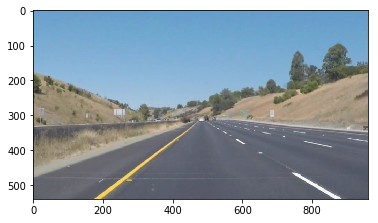
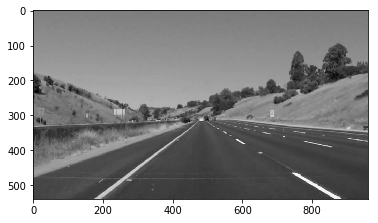
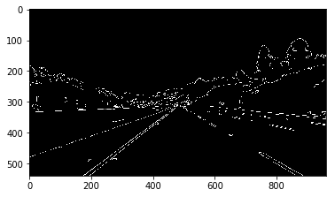
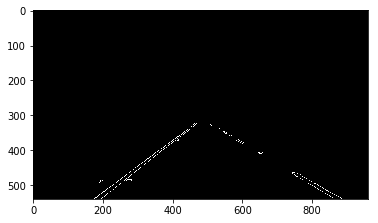
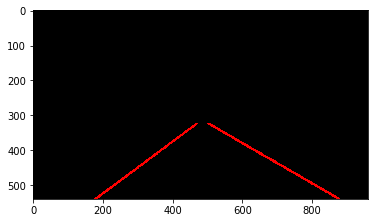
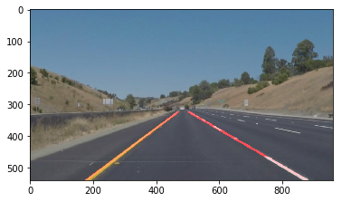

# **Finding Lane Lines on the Road** 

Overview
---

When we drive, we use our eyes to decide where to go.  The lines on the road that show us where the lanes are act as our constant reference for where to steer the vehicle.  Naturally, one of the first things we would like to do in developing a self-driving car is to automatically detect lane lines using an algorithm.

In this project detect lane lines in images using Python and OpenCV.  OpenCV means "Open-Source Computer Vision", which is a package that has many useful tools for analyzing images.  

Reflection
---
### Pipeline Description
In this project, I developed a simple pipeline to find road lanes. The pipeline has the following steps:

1. Convert the original image to grayscale
2. Apply Gaussian blur to the grayscale image, get a blurred image
3. Apply Canny edge detector to the blurred image, get a black image with white adges
4. Apply ROI (region of interest) mask to the edges image to remove all edges outside ROI
5. Apply Hough transform to the masked edges image, get a list of line points as output
6. Transform the Hough lines into left and right lane lines:
	* Discard lines with slopes close to 0 (slopes in range from -0.4 to 0.4)
	* Separate remaining lines in two groups by the sign of the slope
	* Average out slopes and intercepts for each group
	* Return average slopes and intercepts for the left and right lane lines
7. Draw average lane lines on the original image, such that they are only show inside ROI
8. Save the image

Below are the images that show how the pipeline transforms the original image, according to the steps described above:

* Original image 

Grayscale image 

* Blurred grayscale image 

* Canny edges 

* ROI mask applied to Canny edges 

* Final averaged extrapolated lines (red) 

* Final result 

### Potential Shortcomings of Current Pipeline

One potential shortcoming would be what would happen when the car is driving outside road lanes. In this case both lines will have the same slope and my pipeline will likely break down and will draw only one line.

Another shortcoming could be uneven color of the road surface, when there are tire markings on the road. The current pipeling got confused, when the car drove on the patch of bright concrete with black tire marks.

The third shortcoming is that in the video, sometimes lines disappear for a fraction of a second. This means that the pipeline is unable to identify land lines for those frames.

### Possible Improvements of Pipeline
1. dynamically change ROI depending on:
	* road curvature
	* whether the road slopes upward or downward
	* speed of the vehicle

2. I would also try to set up a deep learning system based on convolutional neural networks, collect some annotated data and train the network. I guess that reults would be much better, as CNN show to generalize well in computer vision tasks.

